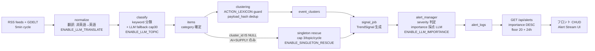
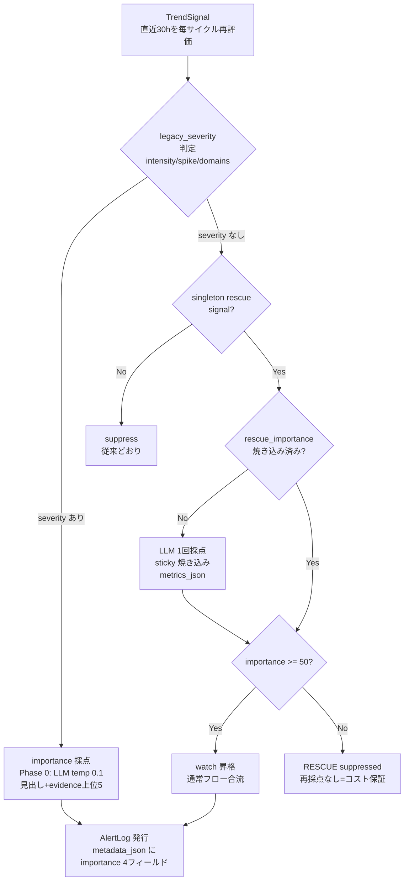
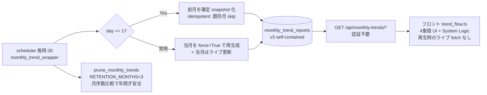

# OSINT Platform — FREE 層 要件仕様書(Alert Stream / Monthly Trend Flow)

> 版: v1.0(2026-06-13)/ 対象 commit: `17c7f67` / 検証環境: 本番(osint-platform-xs7p.onrender.com)
> 本書は FREE 層の2大機能 **Alert Stream** と **Monthly Trend Flow(MTF)** について、バックエンド処理からフロントエンド表示までの実装仕様を、本番 DB・コード・UI の三点照合で検証した上で記録するものである。固有名詞・コード識別子は英語のまま表記する。

## 1. 概要とスコープ

### 1.1 プロダクトの位置づけ
地政学・市場 OSINT ツール。世界の英語ニュース(RSS + GDELT)を5分サイクルで取り込み、LLM(DeepSeek `deepseek-v4-flash`、障害時 Claude fallback)で重要度を採点し、「世界への影響の広さ」軸で厳選したアラートを配信する。

### 1.2 FREE 層の提供物
- **Alert Stream** — importance 順の厳選アラート(All タブ)+ 分野タブの二段表示(厳選 + 全件フィード)
- **Monthly Trend Flow(MTF)** — 月次アーカイブ。high-impact signal を日別・セクター別に振り返る
- **Global Map** — 地理表示(本書のスコープ外)
- ロック面: Market Pulse / Pro Insight / Pro Interactive Map(Pro 層、本書のスコープ外)

### 1.3 二軸の設計思想(最重要)
- **importance(0-100)** = 「世界への影響の広さ」。LLM が見出し+evidence から採点。表示順・閾値の主軸。
- **anomaly(intensity_pct)** = 「自ドメインの直近ベースラインからの逸脱比率」。通常 20-60%。
- 両者は**直交**する。戦争級の事象でも anomaly は低く出うる(steady stream では ratio≈1)。旧 severity/spike 軸はこの直交性により重大事象を取り落としており(偽陰性)、importance 軸への移行で解消した。

### 1.4 関与するデータベーステーブル(FREE 層)
`raw_items` → `items`(+ `item_topics`/`topics`)→ `event_clusters` → `trend_signals` → `alert_logs` → `monthly_trend_reports`
(他の `bea_*` / `cot_reports` / `stripe_events` 等は Pro・課金系でスコープ外)

## 2. Alert Stream 仕様

### 2.1 パイプライン全体(ingest → 表示)

### 2.2 取り込み(ingest)
- 収集ソースは `config/rss_sources.yaml` が真実源(本表より優先)。**RSS 34ソース + GDELT 1**、5分サイクル。

#### 2.2.1 収集ソース一覧(reliability_weight 降順)
| グループ | ソース(weight) |
|---|---|
| official(公式) | Federal Reserve(1.00)/ ECB(1.00)/ SEC(1.00) |
| global_news | BBC World(0.90)/ Al Jazeera(0.85)/ The Guardian World(0.80)/ NYTimes World(0.80) |
| energy | OilPrice(0.85)/ Oil & Gas Journal(0.82)/ Rigzone(0.80) |
| market | MarketWatch(0.85)/ Investing.com(0.75) |
| crypto | CoinDesk(0.85)/ The Block(0.84)/ Cointelegraph(0.78)/ Decrypt(0.78)/ CryptoSlate(0.72) |
| tech / AI / semi | SemiEngineering(0.83)/ MIT Tech Review(0.80)/ TechCrunch(0.80)/ EETimes(0.78)/ Ars Technica(0.78)/ VentureBeat AI(0.76)/ Tom's Hardware(0.76) |
| defense | Defense One(0.83)/ USNI News(0.83)/ Defense News(0.82)/ Breaking Defense(0.82) |
| supply chain / maritime | Maritime Executive(0.80)/ Supply Chain Dive(0.80)/ The Loadstar(0.80)/ gCaptain(0.80)/ FreightWaves(0.78) |
| GDELT(日本語パイロット) | `gdelt_ja_geo`(0.60、`sourcelang:japanese` + theme クエリ、timespan 4h、maxrecords 75) |

- reliability_weight の階層: 公式 1.00 → 大手報道 0.80-0.90 → 専門媒体 0.72-0.84。premium feeds のみで構成されるため、単独 item の足切りに reliability は使えない(全部高信頼)— これが singleton rescue が LLM 採点を必要とする理由の一つ。
- **GDELT-ja の既知課題**: 英語 theme クエリは日本語ソースへのトピックフィルタとして弱く、オントピック率が低い(ノイズは下流の LLM "none" 判定で drop されるため実害は限定的)。日本語クエリへの最適化は backlog。
- GDELT レート制限: 無料 API は5秒1リクエスト。本番は5分間隔のため非抵触。429 は per-source try/except でスキップ。
- 非英語は ingest 時に英訳(`ENABLE_LLM_TRANSLATE=true`、DeepSeek、cap 30/サイクル)。clustering 以降は言語非依存で動く。

### 2.3 分類(classify)
- 一次: keyword ベースのトピック分類(`processor/lightweight_topic.py` が真実源)。6 strategic domains(AI & Semiconductors / Energy & Resources / Global Market Intel / Crypto & Geopolitics / Defense Technology / Supply Chain Intelligence)。
- 二次: keyword-miss を LLM で救済(`llm_classify_fallback`、cap 30/サイクル、temp 0.1)。MARKET の過剰救済はプロンプト厳格化で解消済み(strategic に当たらなければ "none" → drop)。
- 命名の3系統(混同注意): `items.category` = ロング形式(`ai_semiconductor_intelligence` 等)/ `alert_logs.topic` = UPPER 短縮(`AI_TECH`/`SUPPLY_CHAIN` 等)/ フロント `data-topic` = ロング形式。

### 2.4 clustering と signal 生成
- 同一事象の複数ソース報道を `event_clusters` に束ねる(ACTION_LEXICON 11 イベントクラスはマージ拒否専用)。
- `signal_job`: cluster から TrendSignal を生成。http URL なしクラスタは drop。単独 item(cluster_count=1)は通常 TrendSignal にならない。
- **singleton rescue**(`ENABLE_SINGLETON_RESCUE=true`): 重要だが1ソースしか拾えず孤立した item の救済路。対象 = AI + SUPPLY_CHAIN、`cluster_id IS NULL`、24h 窓、cap 3/topic/cycle、48h dedup。`intensity_score=0.0`(正直値)で `metrics_json.singleton_rescue=true` の TrendSignal を作る。

### 2.5 alert_manager(発行判定)

- 採点はコミットメント・ポイント後(確実に発行されるアラートのみ)= 無駄打ちなし。
- rescue の **sticky** 設計: item あたり LLM 生涯1回。30h 窓の毎サイクル再評価でも再採点されない(焼き込み値を読む)。
- 24h cluster-dedupe は発行時に適用済み。

### 2.6 API(`GET /api/alerts`)
- 認証不要(FREE/Guest 全員フル)。order: importance DESC NULLS LAST → triggered_at DESC。
- Stream floor: importance ≥ 20 + 24h 窓(+ pct 実数)。
- serialize: importance 4フィールド(score/rationale/scored_at/model)、`target_label`(タイトル列)、`spike_delta` 等。

### 2.7 フロント表示(Alert Stream UI)
- **All タブ** = importance×anomaly の厳選俯瞰。`alertThreatTier` は importance バンド(≥80 critical / ≥50 elevated / 未満 STANDARD)。CRIT カウンタは importance≥80。
- **分野タブ** = 二段表示。上段 = その分野の厳選アラート(既存 alert_logs)、下段 = 全件フィード(`GET /api/items?topic=`、時系列・LLM-free・importance 表示なし)。ⓘ ガイドで「Stream=厳選 / feed=網羅」を明示。
- **detail ペイン** = ANOMALY ring + IMPORTANCE bar の2軸 + ⓘ。secondary sources は accordion(display トグル、max-height transition は phantom-height 問題で禁止)+ 展開時 `min(48vh,520px)` の局所スクロール。
- **スクロール3状態**(`@media(min-width:901px)` の `.chud-root`): クラス無し(分野タブ・3件+)= 内容追従・ページスクロール / `--sparse`(≤2件)= 縮小 / `--filled`(All)= 固定高 `calc(100vh-120px)` + 内部スクロール。分野タブでは `:not(--filled)` で stream-list/detail を `overflow:visible` 化し、scroll-chain の死角を解消済み。
- **System Logic** = ページタイトル行の ⚙ から開く正直なパイプライン解説オーバーレイ(実データ readout 付き。乱数演出は排除済み)。

## 3. Monthly Trend Flow(MTF)仕様

### 3.1 build & replay

### 3.2 admission(二段ゲート)
- 入力: その月の非 suppressed AlertLog(UTC 月窓、生成時に 24h dedupe 済み)。
- **PRIMARY**: `importance_score >= 50`(`MTF_MIN_IMPORTANCE`)→ 無条件アーカイブ。
- **FALLBACK**: importance 未採点/低の行は `intensity_pct >= 60`(`MIN_ARCHIVE_INTENSITY_FALLBACK_PCT`)で救済。
- 旧 1.5x-spike + 82 anomaly ゲートは撤廃済み(直交軸のため重大事象を全部落としていた)。

### 3.3 snapshot(v3 self-contained)
- `monthly_trend_reports` 1行 = 1ヶ月。列: period_year/month/start/end, label, schema_version("monthly_trend_v3"), nodes_payload, edges_payload, summary_json, alerts_total, alerts_spiked。
- summary_json.signals に per-signal payload を埋め込み(evidence ≤6/signal)。UI は snapshot だけで月を再生(ライブ fetch なし)。
- 6セクター分類 + 座標解決できた signal は SpatialPhysicsEngine で entropy/viscosity/epicenter を計算(UI に出すのは Shannon entropy のみ)。

### 3.4 月次ライフサイクル
- **当月**: 毎時 force 再生成 = ライブ。**過去月**: 月初に確定凍結 = immutable。
- **保持: 当月 + 過去2ヶ月(計3ヶ月)**。それより古い行は毎時の prune で削除。
- 注意: System Logic の「immutable record」表現は過去月に正確。当月はライブ再生成(UI 文言の微調整は backlog)。

### 3.5 フロント(4象限)
TL: 30-DAY IMPACT TRAJECTORY(日クリックで日別フィルタ)/ TR: SECTOR PRESSURE オービット(中央 readout: 全体=TOTAL、ドメイン絞り込み=ドメイン名、日選択=日付。ノードタップでフィルタ)/ BL: HIGH-IMPACT SIGNALS リスト(subnote に二段ゲートを明記)/ BR: SIGNAL DETAIL(Alert Stream の chudDetailHtml を再利用)。月セレクタで保持中の月を切替。

## 4. パラメータ表

| パラメータ | 値 | 場所 |
|---|---|---|
| ingest サイクル | 5分 | scheduler |
| LLM topic 救済 cap | 30/サイクル | `_LLM_TOPIC_PER_CYCLE_CAP` |
| 翻訳 cap | 30/サイクル | normalize |
| rescue 対象 | AI + SUPPLY_CHAIN | signal_job |
| rescue cap / dedup | 3/topic/cycle / 48h | signal_job |
| rescue 閾値 | importance ≥ 50 | alert_manager |
| Stream floor | importance ≥ 20 + 24h | api/routes/alerts.py |
| importance バンド | ≥80 crit / ≥50 elev | フロント alertThreatTier |
| MTF PRIMARY / FALLBACK | imp ≥ 50 / pct ≥ 60 | monthly_trend_builder |
| MTF 保持 | 3ヶ月(当月+2)| RETENTION_MONTHS |
| MTF evidence 上限 | 6/signal | _MAX_EVIDENCE_PER_SIGNAL |
| LLM | deepseek-v4-flash($0.14/M in)、temp 0.1、Claude fallback | llm/client.py |
| 本番 ENV(scheduler のみ)| ENABLE_LLM_TOPIC / ENABLE_GDELT_INGEST / ENABLE_LLM_TRANSLATE / ENABLE_LLM_IMPORTANCE / ENABLE_SINGLETON_RESCUE = 全 true | Render |

## 5. 設計判断の記録
1. **importance 軸への移行**(Alert Stream B-2 → MTF §14): severity/anomaly は事象の規模に盲目。直交性が偽陰性を生んでいた。
2. **正直化の規律**: 演出乱数の排除、System Logic の実データ化、ラベルと実装の一致(SPIKED→HIGH-IMPACT、二段ゲートの明記、物理用語の排除)。表示が実装と食い違ったら表示を直すのではなく、まず実装の真実を確認してから文言を直す。
3. **rescue の sticky/cap 設計**: 30h 毎サイクル再評価 × 素朴な採点 = コスト爆発。sticky 焼き込み(生涯1回)+ cap + 高閾値で月数ドル枠を維持。
4. **二段表示**(§15.5): 厳選(Stream)と網羅(feed)は別物として両立。全件採点はコスト不可のため一覧は時系列・無採点。
5. **既知の制約**: 英語ソース中心(日本語は GDELT パイロット)/ FREE/Guest の Market Pulse 黒画面(Pro フェーズで対応予定)/ 当月 snapshot は厳密には immutable でない。

## 付録: 検証記録(2026-06-13、本番)
- 24h 漏斗: items 295(clustered 81 / singleton 214)→ trend_signals 4,148(rescue 100)→ alert_logs 発行 45・suppressed 0・importance 付与 45/45。
- 縦断トレース: 「Risks to Red Sea Oil Exports」ENERGY / watch / importance 85 / rationale 一貫。
- MTF: 45 total → 35 admitted(imp≥50: 30 + pct fallback: 5)。snapshot 日別分布 = alert_logs 原本と一致。6/11 がほぼ空なのはバグでなく、現体制(importance/rescue 完成形)の実発行開始が 6/12 のため。
- FREE API 到達性: /api/alerts・/api/items・/api/monthly-trends/latest = 無認証 200。
- rescue 初 EMIT(6/12): importance 88/75/62/55 の4本が watch で発行され UI 到達(注入テストに続き実 LLM でも emit パス実証)。
